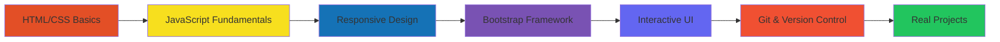

<div align="center">
  
# 👨‍💻 Sachin Yadav

### `Full Stack Developer | UI/UX Enthusiast | Building & Learning in Public`

[](https://git.io/typing-svg)


</div>

---

## 🙋‍♂️ About Me

```javascript
const sachin = {
    location: "India 🇮🇳",
    currentFocus: "Frontend Development & UI Design",
    learning: ["JavaScript", "Responsive Design", "Web Animation"],
    funFact: "console.log() is my debugging best friend 🐛",
    philosophy: "Build → Break → Fix → Learn → Repeat 🔄"
};
```

- 🔭 Currently working on **Practice projects focused on UI/UX and interactive web apps**
- 🌱 Learning **JavaScript fundamentals, problem-solving, and modern CSS techniques**
- 💡 Interested in **Frontend development, clean code, and user experience**
- 🤝 Open to **beginner-friendly collaborations and learning together**
- 💬 Ask me about **HTML, CSS, JavaScript, Bootstrap, WordPress**
- 📫 Reach me: **yadavsachin3166@gmail.com** | **sachinyadav.webdev404@gmail.com**
- ⚡ Fun fact: **I learn best by breaking my own code and fixing it**

---

## 🛠️ Tech Stack & Tools

<div align="center">

### 💻 Languages


### 🎨 Frameworks & Libraries


### 🔧 Tools & Platforms


</div>

---


---

## 📈 Contribution Graph

<div align="center">

[](https://github.com/ashutosh00710/github-readme-activity-graph)

</div>

---

## 🏆 GitHub Trophies

<div align="center">


</div>

---

## 🔥 Current Streak

<div align="center">


### 📅 Contribution Stats

<table>
  <tr>
    <td align="center">
      
    </td>
    <td align="center">
      
    </td>
    <td align="center">
      
    </td>
  </tr>
</table>

</div>

---

## 💼 Recent Projects

<div align="center">

<a href="https://github.com/BuildWithSachin02/price-range-slider">
  
</a>

<a href="https://github.com/BuildWithSachin02">
  
</a>

</div>

---

## 🎯 Learning Journey

<div align="center">



### 📚 Currently Learning
- ⚡ Advanced JavaScript (ES6+)
- 🎨 CSS Animations & Transitions
- 📱 Mobile-First Design
- 🔧 Problem Solving & Logic Building

</div>

---

## 📬 Connect With Me

<div align="center">

[](https://github.com/BuildWithSachin02)
[](mailto:yadavsachin3166@gmail.com)
[](#)

### 💌 Open for collaboration on beginner-friendly projects!

</div>

---

## 💭 Dev Quote

<div align="center">


</div>

---

## 📊 Profile Views

<div align="center">


</div>

---

<div align="center">

### 🌟 Show some ❤️ by starring some repositories!


**Made with 💜 by Sachin Yadav**

*"Building one project at a time, learning one concept at a time"*

</div>
